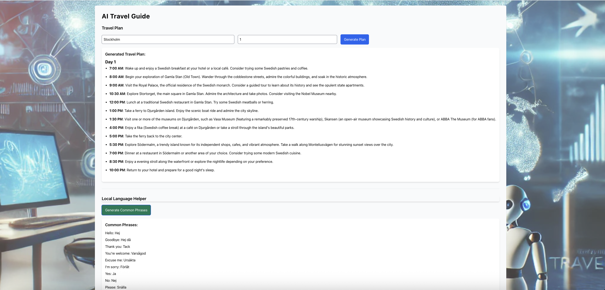

# AI Travel Guide

This project is an **AI-powered Travel Guide** that generates detailed travel plans and translates common phrases into the local language of a specified city or country. **It uses GPT-3** (via the `model.generateContent()` function) to create the travel itinerary and translation data. The project is built with React, Next.js, and Framer Motion for animations.

## Features

- **Travel Plan Generator**:
  - Generate a custom travel plan for a specified city or country for a given number of days.
  - Provides a detailed itinerary in a structured format.
- **Local Language Helper**:
  - Translates 50 common tourist phrases from English to the local language of the specified city or country.
  - Translations are provided in a JSON format.

## Installation

1. Clone this repository to your local machine:
   ```bash
   git clone https://github.com/Shabbo0o/ai-travel.git
   ```
2. Navigate to the project directory:
   ```bash
   cd ai-travel-guide
   ```
3. Install dependencies:
   ```bash
   npm install
   ```
4. Run the development server:
   ```bash
   npm run dev
   ```
5. Open your browser and visit `http://localhost:3000.`

## Technologies Used

- **React:** A JavaScript library for building user interfaces.
- **Next.js:** A React framework for building static and dynamic web applications.
- **Framer Motion:** A library for animations in React applications.
- **Tailwind CSS:** A utility-first CSS framework for rapid UI development.

## Project Structure

    ```bash

    /ai-travel
    ├── /pages
    │ ├── ai-travel.js # Main component for generating travel plans and translations
    │ ├── index.js # Home page displaying the AI Travel Guide
    ├── /utils
    │ ├── ai.js # Utility function for interacting with the AI model
    ├── /public
    │ └── travel.jpg # Image used for background (optional)
    ├── /styles
    │ └── globals.css # Global styles
    ├── /node_modules # Project dependencies
    └── package.json # Project metadata and scripts

    ```

## How It Works

### Travel Plan Generator

- When the user enters a **city** and the **number of days** for the trip, the app sends a request to the AI model with a prompt to generate a detailed itinerary.
- The response is parsed and displayed as a structured travel plan, organized by days with activities and times.

### Local Language Helper

- When the user clicks the button to **Generate Common Phrases**, a prompt is sent to the AI to translate **50 common tourist phrases** from English to the local language of the entered city.
- The translated phrases are displayed in a list format.

## Dependencies

- `react`
- `next`
- `generative-ai`
- `framer-motion`
- `tailwindcss`

## Demo Screenshot


